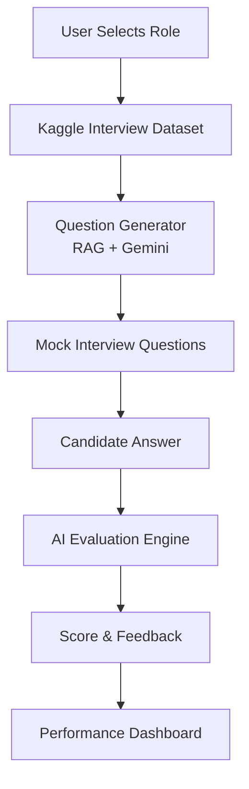

# 🚀 AI Interview Copilot

An AI-powered interview preparation platform that simulates real technical interviews by generating role-specific questions, evaluating candidate responses, and providing personalized feedback using Gemini/OpenAI.

Built with **Python**, **Streamlit**, **LLMs**, and a **Kaggle Interview Questions Dataset**.


---

## 🌟 Features

### 🎯 Interview Generation
- Generate role-specific interview questions
- Support for SDE Intern, Frontend, Backend, Data Analyst, and more
- Dynamic question generation using Gemini API

### 🤖 AI Evaluation
- Evaluate candidate responses
- Score answers automatically
- Identify strengths and weaknesses
- Suggest improvements

### 📊 Performance Analysis
- Overall interview score
- Detailed feedback
- Personalized recommendations
- Interview performance dashboard

### 📄 Resume-Based Interviews
- Upload resume
- Extract technical skills
- Generate personalized interview questions

### 🔍 RAG-Powered Retrieval
- Retrieve relevant questions from Kaggle dataset
- Improve interview quality using Retrieval-Augmented Generation

---

## 🏗️ Project Architecture



---

## 🛠️ Tech Stack

| Category | Technology |
|-----------|------------|
| Frontend | Streamlit |
| Backend | Python |
| LLM | Gemini API / OpenAI |
| Data Processing | Pandas |
| Resume Parsing | PyPDF2 |
| Dataset | Kaggle Interview Questions Dataset |
| Retrieval | RAG |
| Version Control | Git & GitHub |

---

## 📂 Project Structure

```text
AI-Interview-Copilot/
│
├── app.py
├── requirements.txt
├── README.md
│
├── dataset/
│   └── interview_questions.csv
│
├── modules/
│   ├── data_loader.py
│   ├── question_generator.py
│   ├── evaluator.py
│   └── resume_parser.py
│
└── .env
```

---

## ⚙️ Installation

### Clone Repository

```bash
git clone https://github.com/ankitmrj/AI-Interview-Copilot.git
cd AI-Interview-Copilot
```

### Create Virtual Environment

```bash
python -m venv venv
```

### Activate Environment

#### Windows

```bash
venv\Scripts\activate
```

#### Linux / macOS

```bash
source venv/bin/activate
```

### Install Dependencies

```bash
pip install -r requirements.txt
```

---

## 🔑 Configure API Key

Create a `.env` file:

```env
GEMINI_API_KEY=your_api_key_here
```

---

## ▶️ Run Application

```bash
streamlit run app.py
```

Application will start at:

```text
http://localhost:8501
```

---

## 📊 Evaluation Criteria

The AI evaluates responses using multiple dimensions:

| Metric | Description |
|----------|-------------|
| Technical Accuracy | Correctness of concepts |
| Problem Solving | Logical approach |
| Communication | Clarity of explanation |
| Completeness | Coverage of answer |
| Confidence | Structured response quality |

---

## 📈 Sample Workflow

### Step 1
Select Role

```text
SDE Intern
```

### Step 2
Generate Questions

```text
Explain the difference between a process and a thread.
```

### Step 3
Submit Answer

```text
A process is an independent program execution unit...
```

### Step 4
Receive Feedback

```text
Score: 86/100

Strengths:
✔ Good understanding of concepts
✔ Clear explanation

Areas for Improvement:
• Mention memory isolation
• Discuss context switching
```

---

## 🎯 Resume Highlights

- Developed an AI-powered Interview Copilot using Python, Streamlit, and Gemini API to simulate technical interviews.
- Integrated a Kaggle dataset of interview questions with RAG-based retrieval for role-specific question generation.
- Implemented automated answer evaluation, scoring, and personalized feedback using LLMs.
- Built an interactive dashboard for tracking candidate performance and interview readiness.

---

## 🚀 Future Enhancements

- Voice-based mock interviews
- Real-time speech-to-text evaluation
- Company-specific interview preparation
- Resume-to-question generation
- Performance analytics and history tracking
- Multi-round interview simulation
- Coding interview support
- Behavioral interview assessment

---

## 📸 Screenshots

### Home Screen

Add screenshot here

```text
screenshots/home.png
```

### Interview Evaluation

Add screenshot here

```text
screenshots/evaluation.png
```

---

## 🤝 Contributing

Contributions are welcome.

1. Fork the repository
2. Create a feature branch

```bash
git checkout -b feature/new-feature
```

3. Commit changes

```bash
git commit -m "Add new feature"
```

4. Push branch

```bash
git push origin feature/new-feature
```

5. Open a Pull Request

---

## 👨‍💻 Author

### Ankit Srivastav

- GitHub: https://github.com/ankitmrj
- LinkedIn: https://linkedin.com/in/ankit1srivastav

---

## ⭐ Support

If you found this project useful:

⭐ Star the repository

🍴 Fork the project

💼 Connect on LinkedIn

---

## 📄 License

This project is licensed under the MIT License.
